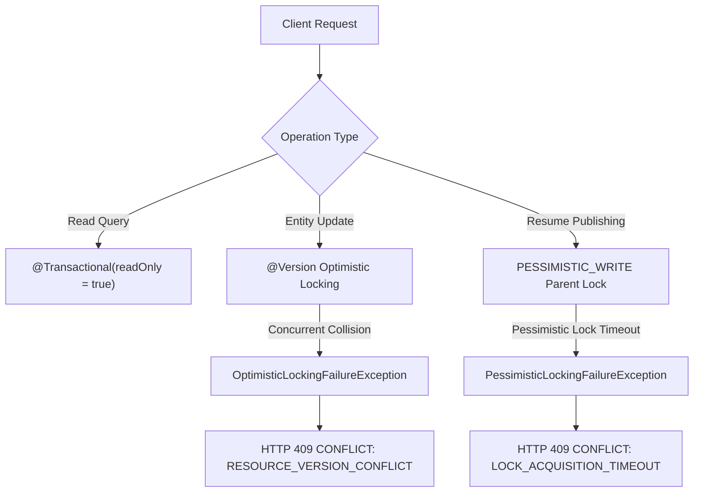

# Database Transaction & Consistency Architecture

## Overview
This document defines the database transaction boundaries, consistency models, locking strategies, rollback behaviors, and error handling mechanisms across DevSphere services (`user-service`, `auth-service`).

## Transaction Boundary Rules
1. **Service-Layer Scope**: Business transactions belong strictly at the service layer (`@Service`). Controllers and repositories do not initiate or manage `@Transactional` boundaries.
2. **Atomic Multi-Step Operations**: Any operation modifying multiple entities or combining business state with event records executes inside a single database transaction:
   $$\text{BEGIN} \rightarrow \text{Validate} \rightarrow \text{Mutate Entity A} \rightarrow \text{Mutate Entity B} \rightarrow \text{Write Outbox Event} \rightarrow \text{COMMIT}$$
3. **Rollback Semantics**: Any unchecked runtime exception (`RuntimeException`) or explicit rollback signal triggers complete transaction rollback. Partial database commits are strictly prohibited.
4. **Read-Only Optimization**: Pure query operations utilize `@Transactional(readOnly = true)` to optimize Hibernate persistence context memory usage and document read-only intent.

## Locking & Concurrency Control



### 1. Optimistic Locking (`@Version`)
Entities subject to concurrent modification (`ResumeProfile`, `Goal`, `Task`, `DeveloperProject`, `UserProfile`) include an optimistic version field:
```java
@Version
@Column(name = "version")
private Long version;
```
When two concurrent requests attempt to update the same record version:
- Hibernate detects the version mismatch during flush.
- Throws `ObjectOptimisticLockingFailureException`.
- `GlobalExceptionHandler` converts the exception into HTTP `409 CONFLICT` with code `RESOURCE_VERSION_CONFLICT` and payload message `"The resource was modified by another request"`.

### 2. Pessimistic Locking (`PESSIMISTIC_WRITE`)
Resume publishing (`publishVersion`) utilizes parent-row pessimistic locking on `ResumeProfile`:
```java
@Lock(LockModeType.PESSIMISTIC_WRITE)
@Query("SELECT r FROM ResumeProfile r WHERE r.id = :id AND r.userId = :userId")
Optional<ResumeProfile> findByIdAndUserIdForUpdate(Long id, Long userId);
```
This guarantees that concurrent version publishing requests for the same resume profile block and execute serially, maintaining the strict invariant that **exactly one resume version remains in `PUBLISHED` status**.

## Transactional Outbox Consistency
Business database updates and Outbox event record creations are committed inside the exact same database transaction:
```java
@Transactional
public RegisterResponse registerUser(RegisterRequest request) {
    UserCredential savedCredential = userCredentialRepository.save(credential);
    outboxService.saveUserRegisteredOutboxEvent(savedCredential.getId());
    return new RegisterResponse(...);
}
```
If saving the Outbox event fails, the database transaction rolls back, preventing dangling business records without corresponding events. Kafka publishing occurs asynchronously after transaction commit via the Outbox Publisher background process.

## Redis Cache & Transaction Relationship
1. **Source of Truth**: MySQL primary database is the sole source of truth.
2. **Post-Commit Eviction**: Redis cache invalidation/eviction occurs after primary database operations.
3. **Fault Tolerance**: If Redis is unavailable or fails, database transactions commit normally without failure, failing open safely.

## Database Constraint Exception Handling
Raw database constraint errors (`SQLIntegrityConstraintViolationException`, `ConstraintViolationException`) are intercepted by `DataIntegrityViolationException`:
- `GlobalExceptionHandler` converts raw SQL errors into HTTP `409 CONFLICT`.
- Code: `DATABASE_CONSTRAINT_VIOLATION`.
- Standardized user-facing message: `"Database constraint violation occurred"`.
- Prevents database table names, column names, raw SQL statements, or internal stack traces from leaking to API callers.
