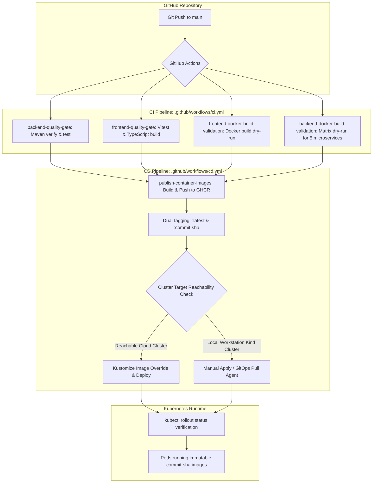

# CI/CD GHCR Deployment Runbook

This runbook documents the architecture, automation pipelines, container registry configurations, deployment workflows, and operational procedures for **DevSphere** automated CI/CD using GitHub Actions, GitHub Container Registry (GHCR), and Kubernetes (Kustomize).

---

## 1. CI/CD Architecture Overview

The DevSphere deployment pipeline enforces automated quality gates, immutable container tagging, container registry publishing, declarative manifest transformations, and progressive rollout verifications.



---

## 2. GitHub Container Registry (GHCR) Configuration

### Package Naming Convention
Images are published under the owner's GitHub namespace (`ghcr.io/<owner>/<image-name>`):
- `ghcr.io/prajapatipushkar/devsphere-api-gateway`
- `ghcr.io/prajapatipushkar/devsphere-auth-service`
- `ghcr.io/prajapatipushkar/devsphere-user-service`
- `ghcr.io/prajapatipushkar/devsphere-config-server`
- `ghcr.io/prajapatipushkar/devsphere-service-discovery`
- `ghcr.io/prajapatipushkar/devsphere-frontend`

### Tagging Policy: Immutable Tags
Every build produces two tags:
1. `:<commit-sha>`: **Immutable identifier** tied to the exact Git commit SHA (`${{ github.sha }}`). This provides complete traceability and auditability.
2. `:latest`: Moving pointer representing the most recent successful build on `main`.

> [!IMPORTANT]
> Kubernetes production deployments must always reference the immutable `:<commit-sha>` tag. Never rely on `:latest` in deployment manifests, as `:latest` conceals runtime drift and invalidates rollout rollbacks.

### Authentication & Permissions
Workflows utilize the built-in `${{ secrets.GITHUB_TOKEN }}` with explicit scoped permissions:
```yaml
permissions:
  contents: read
  packages: write
```

For private GHCR packages pulled by Kubernetes, an `imagePullSecrets` secret named `ghcr-secret` is configured in the `devsphere` namespace:
```bash
kubectl create secret docker-registry ghcr-secret \
  --docker-server=ghcr.io \
  --docker-username=<GITHUB_USERNAME> \
  --docker-password=<GITHUB_PAT_WITH_READ_PACKAGES> \
  --namespace=devsphere
```

---

## 3. Workflow Triggering & Quality Gates

### Quality Gate Hierarchy (`ci.yml`)
1. **`backend-quality-gate`**:
   - Compiles and runs all unit & integration tests using Maven (`mvn -B clean verify`).
   - Validates all 5 Spring Boot microservices (`api-gateway`, `auth-service`, `user-service`, `config-server`, `service-discovery`).
2. **`frontend-quality-gate`**:
   - Executes Vitest unit tests (`npm test -- --run`).
   - Validates TypeScript typing and builds production assets (`npm run build`).
3. **`frontend-docker-build-validation`**:
   - Executes non-push Docker build for the frontend with `VITE_API_BASE_URL=https://api.devsphere.local` build argument.
4. **`backend-docker-build-validation`**:
   - Matrix build verifying Dockerfiles across all 5 backend microservices without publishing.

### Continuous Deployment (`cd.yml`)
- Triggers automatically upon push to `main` branch or manual `workflow_dispatch`.
- Publishes all 6 container images concurrently to GHCR.
- Performs target cluster connectivity check (`kubectl cluster-info --request-timeout=10s`).
- Dynamically updates image references using `kustomize edit set image`.
- Applies manifests and waits for rollout confirmation (`kubectl rollout status`).

---

## 4. Local Kind vs. Cloud Kubernetes Deployment

### The Local Reachability Reality
The local Kind cluster runs inside WSL2 on Windows, bound to the local loopback interface (`127.0.0.1:50100`):
```
Kubernetes control plane is running at https://127.0.0.1:50100
CoreDNS is running at https://127.0.0.1:50100/api/v1/namespaces/kube-system/services/kube-dns:dns/proxy
```
**GitHub-hosted runners operate in isolated Microsoft Azure cloud VMs and cannot route into private workstation loopback networks.**

Attempting to pass a raw local Kind `kubeconfig` to a GitHub-hosted runner fails with connection timeouts:
```
Unable to connect to the server: dial tcp 127.0.0.1:50100: connect: connection refused
```

### Supported Deployment Patterns

| Environment | Architecture | Mechanism | Security Posture |
| :--- | :--- | :--- | :--- |
| **Local Kind (Current)** | Local Kustomize Apply | Developer/script pulls from GHCR or builds locally; applies with `kubectl apply -k k8s/` | High (zero external port exposure) |
| **Local Kind (Automated)** | Pull-Based GitOps (ArgoCD / Flux) | In-cluster agent polls Git/GHCR and pulls changes outward over HTTPS | High (no inbound ports or tunnels needed) |
| **Local Kind (CI Runner)** | Self-Hosted GitHub Runner | GitHub runner daemon installed inside local workstation polling GitHub jobs | Moderate (requires managing local runner daemon) |
| **Cloud K8s (GKE/EKS/AKS)** | Push-Based CD with OIDC | GitHub Action assumes IAM role via OpenID Connect (Workload Identity) | Industry Standard (zero static credentials) |

---

## 5. Applying GHCR Images to Local Kind Cluster

To update the local Kind cluster with images published to GHCR for a specific commit SHA:

### Step 1: Set Kustomize Image Overrides
```powershell
$COMMIT_SHA = "<target-commit-sha>"
$OWNER = "prajapatipushkar"

cd k8s
kustomize edit set image devsphere-api-gateway=ghcr.io/$OWNER/devsphere-api-gateway:$COMMIT_SHA
kustomize edit set image devsphere-auth-service=ghcr.io/$OWNER/devsphere-auth-service:$COMMIT_SHA
kustomize edit set image devsphere-user-service=ghcr.io/$OWNER/devsphere-user-service:$COMMIT_SHA
kustomize edit set image devsphere-config-server=ghcr.io/$OWNER/devsphere-config-server:$COMMIT_SHA
kustomize edit set image devsphere-service-discovery=ghcr.io/$OWNER/devsphere-service-discovery:$COMMIT_SHA
kustomize edit set image devsphere-frontend=ghcr.io/$OWNER/devsphere-frontend:$COMMIT_SHA
cd ..
```

### Step 2: Apply Manifests
```powershell
kubectl apply -k k8s/
```

### Step 3: Verify Rollouts
```powershell
kubectl rollout status deployment/devsphere-config-server -n devsphere --timeout=180s
kubectl rollout status deployment/devsphere-service-discovery -n devsphere --timeout=180s
kubectl rollout status deployment/auth-service -n devsphere --timeout=180s
kubectl rollout status deployment/user-service -n devsphere --timeout=180s
kubectl rollout status deployment/api-gateway -n devsphere --timeout=180s
kubectl rollout status deployment/devsphere-frontend -n devsphere --timeout=180s
```

---

## 6. Rollback Procedures

If a deployment fails health checks or introduces regression:

### Fast Rollback via Kubectl
Roll back the deployment to the previous revision immediately:
```powershell
kubectl rollout undo deployment/api-gateway -n devsphere
kubectl rollout undo deployment/auth-service -n devsphere
kubectl rollout undo deployment/user-service -n devsphere
kubectl rollout undo deployment/devsphere-frontend -n devsphere
```

### Declarative Rollback via Git
1. Revert the problematic commit on `main`:
   ```bash
   git revert <bad-commit-sha>
   git push origin main
   ```
2. The CI/CD pipeline automatically builds the reverted code, assigns a new immutable commit SHA, publishes to GHCR, and deploys the known stable build.

---

## 7. Troubleshooting Common CI/CD Issues

### 1. GHCR 403 Forbidden / Package Publishing Error
- **Symptom**: `denied: installation not allowed to Write organization package` or `403 Forbidden` during `docker push ghcr.io/...`
- **Root Cause**: The repository lacks write permissions to GitHub Packages or `GITHUB_TOKEN` is missing `packages: write`.
- **Resolution**:
  1. Verify `.github/workflows/cd.yml` declares:
     ```yaml
     permissions:
       contents: read
       packages: write
     ```
  2. In GitHub repository settings: **Settings > Actions > General > Workflow permissions** -> select **"Read and write permissions"**.

### 2. Kubernetes ImagePullBackOff / ErrImagePull
- **Symptom**: Pod fails to start with `ErrImagePull` or `ImagePullBackOff`.
- **Root Cause**: The package visibility in GHCR is Private, and the Kubernetes cluster lacks valid pull credentials.
- **Resolution**:
  1. Either change package visibility to **Public** in GitHub profile/org under **Packages > Package Settings > Change visibility**.
  2. Or configure `imagePullSecrets: [name: ghcr-secret]` on the pod templates and provide a personal access token (PAT) with `read:packages` scope.

### 3. Frontend Mixed Content / SSL API Errors
- **Symptom**: Browser console logs `Blocked mixed content: http://...` when accessing `https://devsphere.local`.
- **Root Cause**: Frontend image was built with `http://localhost:8080` or HTTP URL instead of `https://api.devsphere.local`.
- **Resolution**:
  - Ensure `VITE_API_BASE_URL=https://api.devsphere.local` is passed as a `build-arg` in Dockerfile, `ci.yml`, and `cd.yml`.

### 4. Kind Node Resource Exhaustion / Deadlock During Rollout
- **Symptom**: New pods remain `Pending` indefinitely during `kubectl rollout status`.
- **Root Cause**: Default `RollingUpdate` strategy has `maxSurge: 25%`, attempting to create new pods before terminating old pods on a node with 81% memory request saturation.
- **Resolution**:
  - Ensure all single-replica deployments specify:
    ```yaml
    strategy:
      type: RollingUpdate
      rollingUpdate:
        maxUnavailable: 1
        maxSurge: 0
    ```
